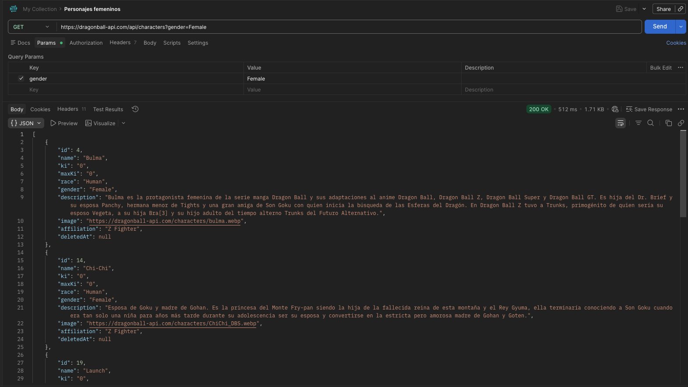
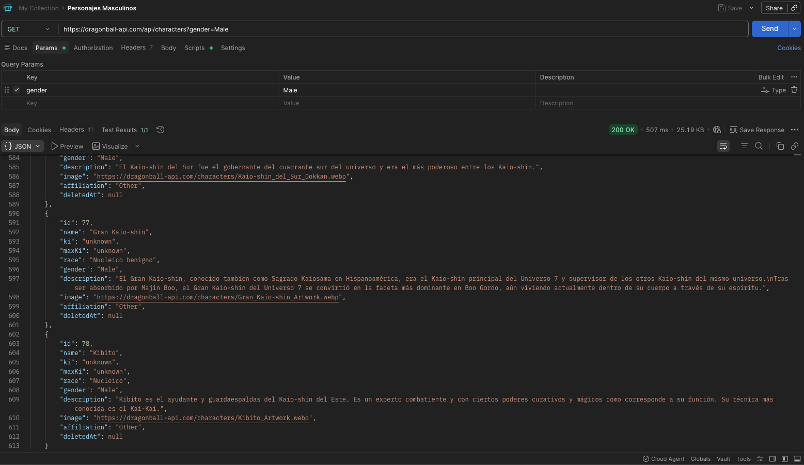
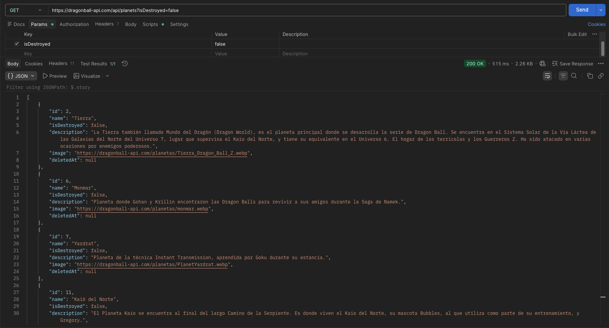
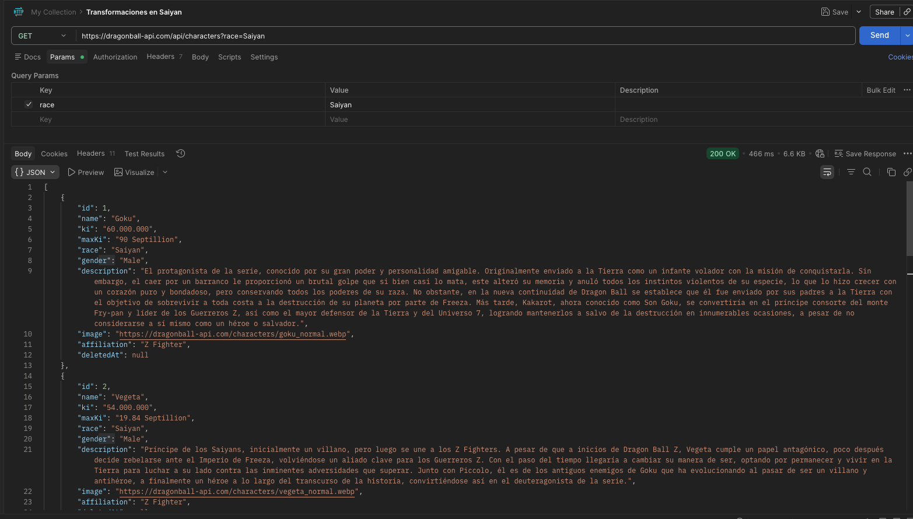
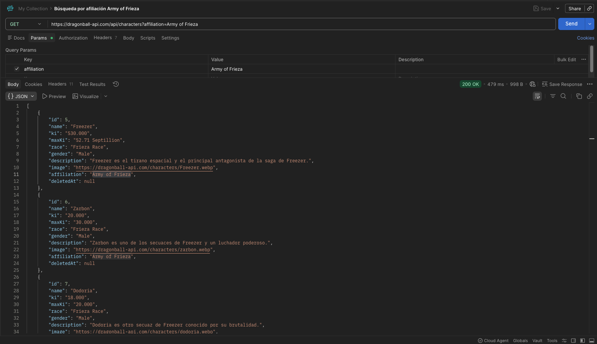
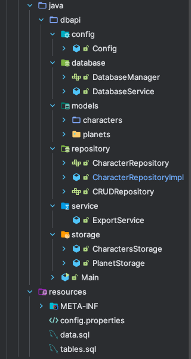

# DBAPI
Proyecto de recuperación de la unidad 1 acceso a datos

## Capturas postman

## Manual técnico

Este proyecto implementa una arquitectura modular para consumir datos desde una API externa (en formato JSON), almacenarlos en una base de datos local y permitir su exportación nuevamente a archivos JSON.  
El objetivo es integrar un flujo completo de **ingesta, persistencia y exportación de datos**, aplicando principios de separación de responsabilidades y patrones de diseño (como Repository y Service).

---

##  Arquitectura del Proyecto

---

##  Configuración (`config`)

### `Config.java`
Define la configuración general del proyecto:
- Parámetros de conexión a la base de datos (desde `config.properties`).
- Rutas y constantes para los archivos JSON.
- Variables globales de entorno.

---

## ️ Base de Datos (`database`)

### `DatabaseManager.java`
Responsable de:
- Establecer y cerrar conexiones con la base de datos.
- Ejecutar consultas SQL.
- Gestionar transacciones (commit/rollback).
- Inicializar el esquema a partir de `tables.sql` y `data.sql`.

### `DatabaseService.java`
Capa de servicio que:
- Orquesta las operaciones CRUD a través de los repositorios.
- Interactúa con `DatabaseManager` para operaciones de bajo nivel.
- Asegura la persistencia del modelo (`Character`).

---

##  Modelos (`models`)

Representan las entidades principales del dominio:
- **Character** → datos de personajes.
- **Planet** → datos de planetas.

Cada paquete contiene sus POJOs (Plain Old Java Objects) con atributos, constructores, getters/setters y `toString()`.

---

##  Repositorios (`repository`)

Implementan el patrón **Repository**, aislando la lógica de acceso a datos.

### `CRUDRepository<T>`
Interfaz genérica con operaciones básicas:
- `create(T entity)`
- `read(id)`
- `update(T entity)`
- `delete(id)`
- `findAll()`

### Repositorios Específicos
- `CharacterRepository` / `Impl`

Cada implementación:
- Define consultas SQL específicas.
- Mapea los resultados (`ResultSet`) a objetos del modelo correspondiente.
- Usa `DatabaseManager` para ejecutar sentencias.

---

##  Almacenamiento JSON (`storage`)

Gestiona la lectura y escritura de datos desde/hacia archivos JSON obtenidos de la API.

### `CharacterStorage.java`
Responsable de:
- Consumir los endpoints de la API.
- Parsear las respuestas JSON.
- Crear instancias de los modelos (`Character`).
- Proveer datos a `DatabaseService` para su inserción.

### `PlanetStorage.java`
Responsable de:
- Consumir los endpoints de la API.
- Parsear las respuestas JSON.
- Crear instancias de los modelos (`Planet`).
---

[//]: # (##  Exportación &#40;`service`&#41;)

[//]: # ()
[//]: # (### `ExportService.java`)

[//]: # (Permite exportar los datos almacenados en la base de datos a archivos CSV locales:)

[//]: # (- Recupera la información mediante los repositorios.)

[//]: # (- Serializa los objetos en formato CSV.)

[//]: # (- Guarda los archivos en el sistema de ficheros.)

[//]: # ()
[//]: # (---)

[//]: # ()
[//]: # (##  Flujo General de Ejecución)

[//]: # ()
[//]: # (1. **Storage** obtiene los datos de la API en formato JSON.)

[//]: # (2. **DatabaseService** recibe los objetos y los inserta en la base de datos usando los **repositories**.)

[//]: # (3. **ExportService** puede generar un nuevo CSV consolidado desde los datos locales.)

[//]: # ()
[//]: # (---)

[//]: # ()
[//]: # (##  Requisitos)

[//]: # ()
[//]: # (- Java 17+)

[//]: # (- Dependencias JDBC &#40;según la BD usada&#41;)

[//]: # (- Librerías JSON &#40;ej. `Gson`, `Jackson`&#41;)

[//]: # ()
[//]: # (---)
